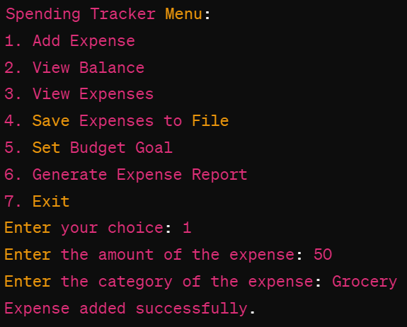

This README file provides an overview of the spending tracker application, including its features, installation instructions, usage guide, and information on contributing and licensing. You can customize it further to include specific details about your application.

# Spending Tracker Application

The Spending Tracker Application is a Java-based command-line application designed to help users manage and analyze their personal expenses. Users can add expenses, view their current balance, set budget goals for different expense categories, generate expense reports, and save their expenses to a file for future reference.

## Features

- Add Expense: Allows users to add new expenses with specified amounts and categories.
- View Balance: Displays the current balance based on the recorded expenses.
- View Expenses: Shows a list of recorded expenses categorized by expense type.
- Set Budget Goal: Enables users to set budget goals for different expense categories.
- Generate Expense Report: Generates a detailed expense report showing expenses by category and their status (under budget or over budget).
- Save Expenses to File: Allows users to save their recorded expenses to a file for future reference.

## Getting Started

### Prerequisites

- Java Development Kit (JDK) installed on your system.
- A text editor or an Integrated Development Environment (IDE) for Java development.

